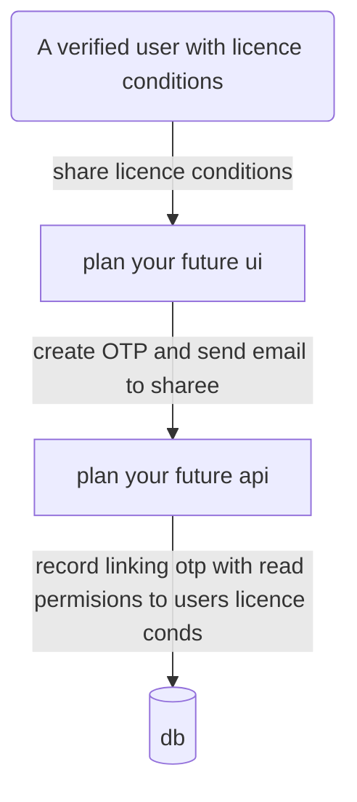
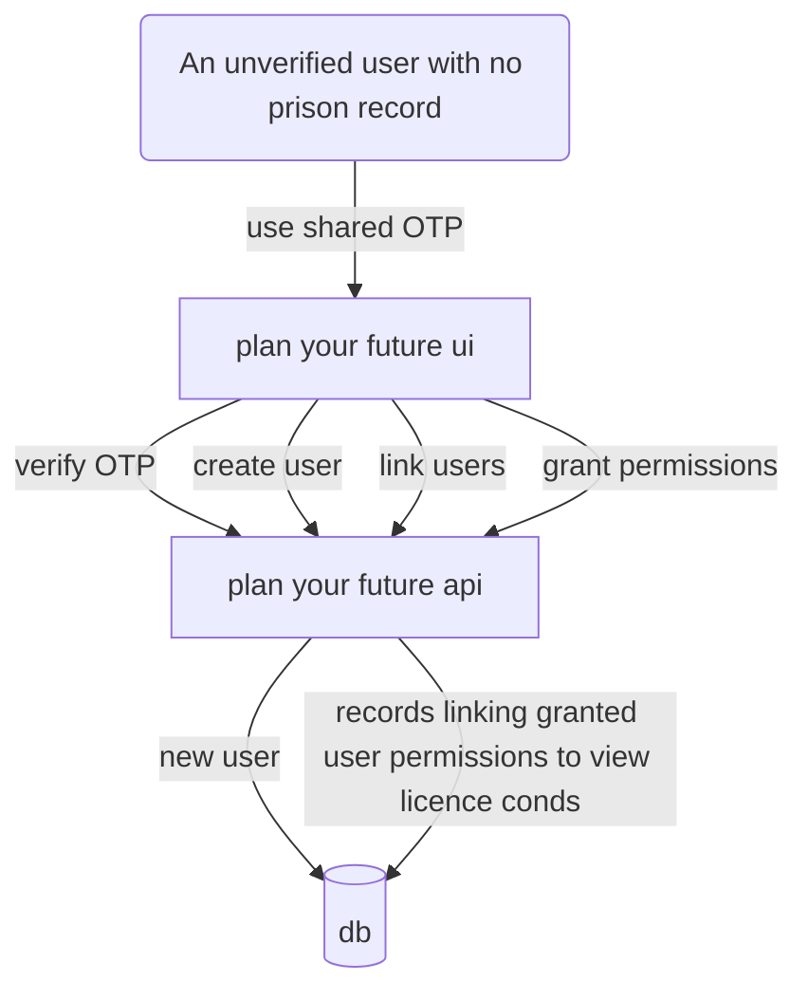
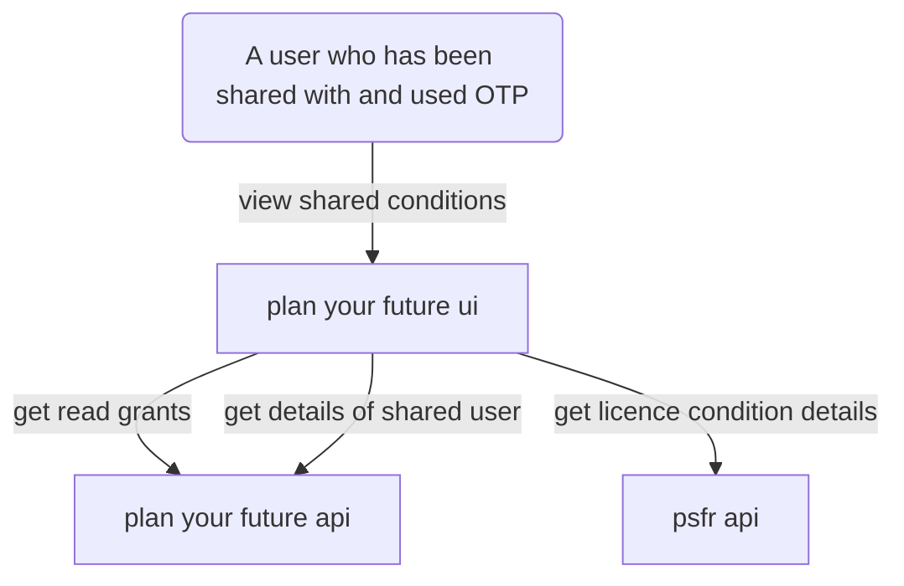

# Delegated access flows

## Signed in and verified user shares licence conditions

```mermaid
flowchart TD
    veri-user(A verified user with licence conditions)
    ui[plan your future ui]
    api[plan your future api]
    db[(db)]
    
    veri-user -->|share licence conditions| ui
    ui -->|create OTP and send email to sharee|api
    api -->|record linking otp with read permisions to users licence conds|db
```

## New user with a shared OTP signs up

```mermaid
flowchart TD
    new-user(An unverified user with no prison record)
    ui[plan your future ui]
    api[plan your future api]
    db[(db)]
    
    new-user -->|use shared OTP| ui
    ui -->|verify OTP|api
    ui -->|create user|api
    ui -->|link users|api
    ui -->|grant permissions|api
    api -->|new user|db
    api -->|records linking granted user permissions to view licence conds|db
```

## User views shared licence conditions

```mermaid
flowchart TD
    user(A user who has been shared with and used OTP)
    ui[plan your future ui]
    api[plan your future api]
    psfr[psfr api]
    
    user -->|view shared conditions|ui
    ui -->|get read grants|api
    ui -->|get details of shared user|api
    ui -->|get licence condition details|psfr
```